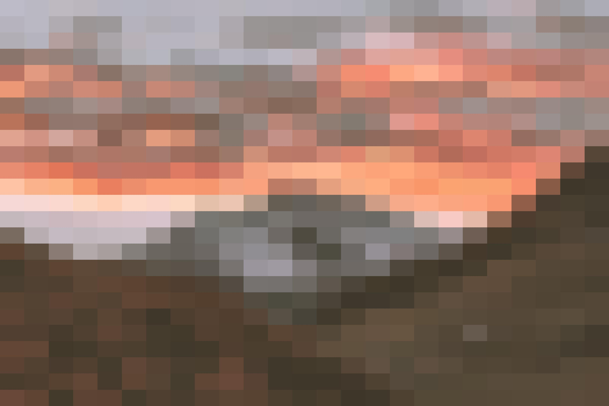
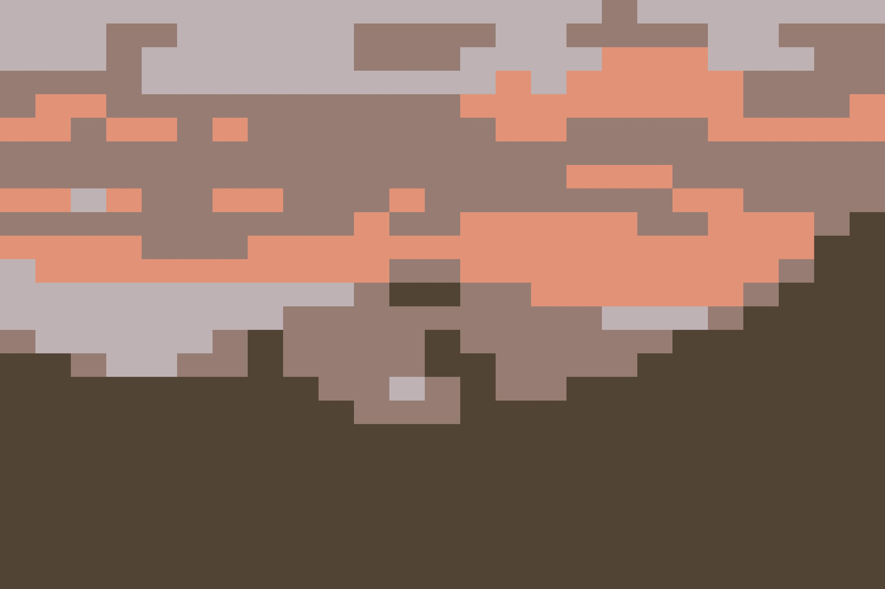
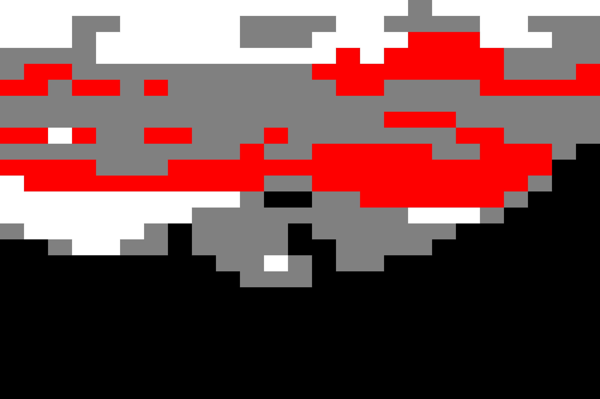

# Image Tiling

This projects contains a Python script for reducing the number of colors in an image and transforming it into a pixelated version using predefined tile colors. This project uses KMeans clustering to identify dominant colors in the image and maps them to a set of predefined colors.

## Demo

### Step 0 - Original Image


### Step 1 - Pixelate image
The image is pixelated to 25×25 pixels by downscaling using the PIL resize function.



### Step 2 - Reduce Colors
The image is reduced to 4 colors using KMeans clustering to find the dominant colors in the image. 


### Step 3 - Remap Colors
The four found colors are remapped to a set of predefined colors - red, white, black, and gray.
<br> This is accomplished by calculating the Euclidean distances in RGB space between the found and predefined colors.


## To Run

### Option 1: Run locally
To run the Python script and generate your own image locally, simply use `server\pixelator.py`. Make sure to put your own parameters under 
```
if __name__ == "__main__":
```
and save the file to your desired location.

The requirements to run this script are:
```
joblib==1.4.2
numpy==2.2.1
pillow==11.1.0
scikit-learn==1.6.1
scipy==1.15.1
threadpoolctl==3.5.0
```